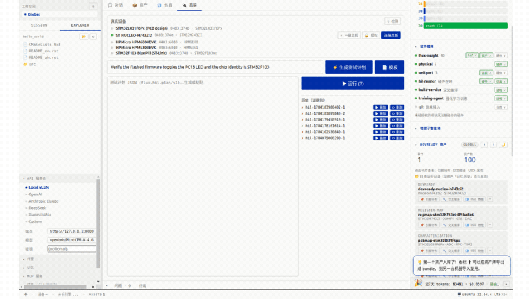
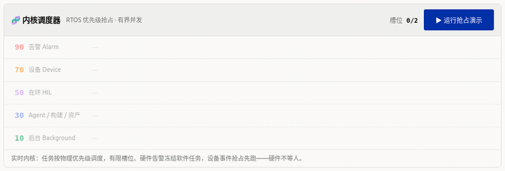
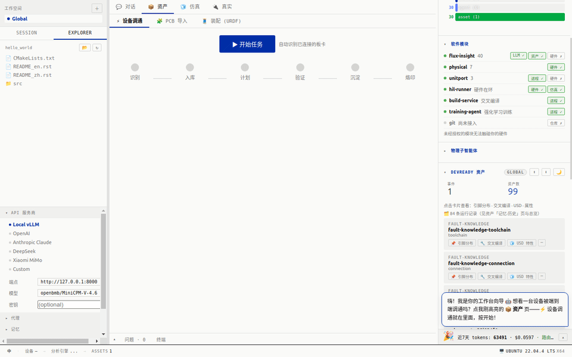
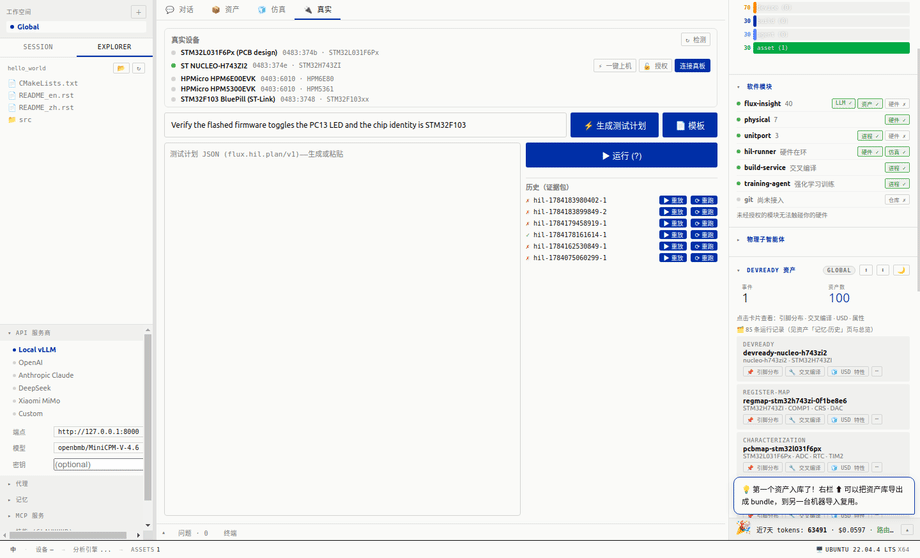
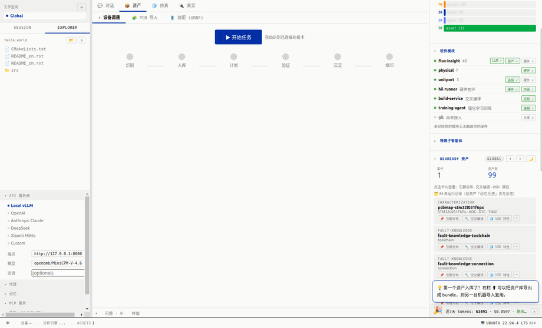
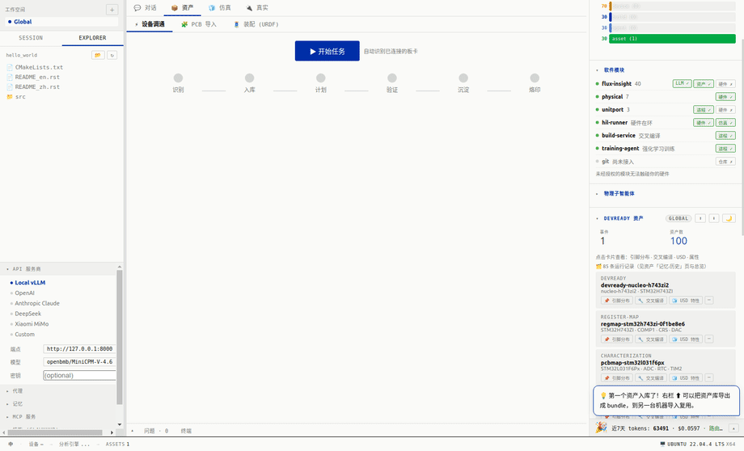

# Flux Workbench

> **为物理世界打造的 AI 原生开发操作系统。**
> The AI-native operating system for building the physical world — where agents and hardware are first-class citizens of one real-time kernel.

<div align="center">

[](docs/media/fluxworkbench-tutorial.mp4)

### ▶ [点击播放完整 4 分钟教程（含中文解说）](docs/media/fluxworkbench-tutorial.mp4)

设备上机 · 真板调通 · PCB→BSP · 实时内核 · DevReady 资产 — 上方为实机演示循环
*A 4-minute narrated walkthrough — onboard a board, real bring-up, and the asset flywheel.*

</div>

开发物理世界，慢从来不在写代码——在**每一次都要从头搞懂一块板子**：引脚怎么连、寄存器怎么摆、时钟怎么配、上电为什么不亮。这些理解散落在数据手册、原理图、十几个互不相通的厂商工具里，一次会话结束就蒸发，下一块板子、下一个人从零再来。

Flux Workbench 把这套理解交给 Agent，并且在底座上做对了两件事：

1. **Agent 与硬件跑在同一个实时内核里。** 物理事件（过流、探针失联）能抢占一切软件任务——「硬件不等人」。调度按物理优先级，不是先来后到。
2. **每一小时的调通都沉淀成一份自描述的「活资产」。** 引脚 / RTOS / 调试记忆 / 官方资料，序列号烙进芯片。下一次、下一个人、下一个 Agent 直接站在上面继续。

于是硬件开发从一次性的手工活，变成**越用越快的复利**。这不是一个更聪明的编辑器，是给物理开发新造的一层操作系统。

---

## 🎬 它在跑 / See it run

真界面、真数据、真交互——下面每一段都由 Playwright 驱动真实 Electron 应用自动录制，不是设计稿、不是拼接演示。索引与逐格剧本：**[docs/tutorials/](docs/tutorials/README.md)**

### ⭐ 07 · 实时内核调度 — Agent 与硬件同为一等公民　[剧本](docs/tutorials/07-kernel-scheduler.md)
五条 RTOS 优先级带的**实时占用**：软件任务（agent 推理 / 构建 / 资产 / 后台遥测）在有限槽位里按优先级排队跑；硬件告警一响（探针失联），Device 带的任务**插队先跑**、所有低优先级软件任务**瞬间冻结变红**，告警解除再恢复排队。整段读的是内核每次入队 / 出队 / 抢占真发出的 `scheduler.state`。这就是「硬件不等人」在调度层的样子。


### 01 · PCB → BSP　[剧本](docs/tutorials/01-pcb-to-bsp.md)
贴一个 GitHub 链接 → 自动克隆、解析设计文件（.ioc + 网表）→ 提取 MCU / 引脚 / 外设 → 交互连接图（点器件看它连了哪些引脚）。从零件到板级支持包，零命令行、零编造。


### 02 · 设备上机　[剧本](docs/tutorials/02-device-onboard.md)
插上任意 MCU 开发板 → ⚡一键上机：识别探针 + 读序列号 + 认芯片 + 拉官方寄存器手册（2955 个寄存器入库）+ 序列号写进资产。任何一块陌生板子，几秒钟建档。


### 03 · 真板调通 + 芯片烙印　[剧本](docs/tutorials/03-real-bringup-and-bind.md)
一个按钮，六阶段黄金路径：识别 → 入库 → 计划 → 验证 → 沉淀 → 烙印。真板 NUCLEO-H743，读到 IDCODE `0x20036450`，把 DevReady 记录烙进芯片 Flash，断电重连仍在。


### 04 · DevReady 资产　[剧本](docs/tutorials/04-devready-asset.md)
每块调通的板子沉淀成一个自描述、自包含的 `.flux` 活档案：引脚 / RTOS / 调试记忆 / 官方资料 / 生命记录。这是飞轮攒下的「本金」。


### 05 · 小Flux 助手　[剧本](docs/tutorials/05-desk-pet-guided.md)
右下角桌宠：说人话即操作。AI 把你的意图分类到一条已知流程，高亮该点的控件，一步步带你走完——不替你操作，而是让你自己点、越点越会。


> **06 · 跨平台一键安装** — [剧本](docs/tutorials/06-install.md)（Windows / macOS / Linux 内嵌运行时，装完即用；此条为纯操作流程，暂未录 GIF）

---

## 🧭 第一性原理 / Why a kernel, not an editor

- **硬件不等人。** 物理世界的事件（过流、丢帧、探针掉线）有硬实时约束，必须能抢占一切。所以底座得是一个按物理优先级调度的**实时内核**：Alarm 90 · Device 70 · HIL 50 · Agent/Build/Asset 30 · Background 10，硬件事件永远压过软件推理。
- **知识必须复利。** 每一次调通的理解若不落地，就会随会话蒸发。所以每块板子沉淀成**自描述活资产**，序列号烙进芯片——下一个 Agent 直接接手。
- **物理子智能体是一等公民。** OpenOCD 这类硬件驱动不是「外挂脚本」，而是内核里可调度、带能力签名的**具身 Agent**，和推理 Agent 平权。
- **为什么是现在（why now）。** 模型刚好跨过三条线：多模态能读原理图、agentic 能长链路调工具、长上下文能承载一块板的全部记忆。三年前做不了，今天正好。

## ✅ 今天已经是真的 / Real today

- **真板全流程跑通**：NUCLEO-H743 读到 IDCODE `0x20036450`，DevReady 记录烙进 Flash `0x080E0000`，断电重连仍在。
- **40 个 MCP 工具**（仅 flux-insight 一个服务）+ 四个 MCP 服务协同：SVD/数据手册/网表入库、芯片验证与烙印、板卡技能生成、考场跑分、记忆整理……
- **跨平台一键安装**：Windows `.exe` / macOS `.dmg` / Linux `.AppImage`/`.deb`，内嵌 CPython 运行时，装完即用，无需自己配 Python/Node/conda。
- **每段演示都可复现**：Playwright 驱动真实 Electron 录制，脚本连同断言一起进仓（如调度演示会断言抢占**真的发生**）。

## 🏗 架构 / Architecture

**两个核**：
- **基础设施核** — 统一的 `3 轴 × 2 资源` 调度器（流 / 时间 / 优先级 × 计算 / 存储）、全进程微内核、能力签名模块、uORB-over-Zenoh 总线。硬件优先、Agent 辅助。
- **应用核** — 四个一等原语（`subagent` / `loop` / `devready` / `simulation`）+ 工作流调度，全部是调度器 `Task` 的特化。

**三层语言**（各司其职）：

| 层 | 语言 | 职责 |
|---|---|---|
| base | TypeScript | Electron studio（Warp 级 UI）+ **内核** |
| execution | Python | AI Agent + 工作流 + 会话 / DevReady |
| tool | C/C++ | OpenOCD / 未来 motor·CAN·SPI（实时具身 Agent）|

**深耕的六个硬件开发痛点**（v1 已解 ①②④⑤⑥；③ 仪器接入 v2）：

| # | 痛点 | 解法 |
|---|---|---|
| ① | CubeMX UI 锁死 | 外设/引脚/时钟**代码生成**（可脚本、Agent 驱动）|
| ② | 原理图 ≠ 可读数据 | 本地多模态模型 → 网表 + 器件 + 信号 |
| ③ | 仪器（示波器/逻辑分析仪）| SCPI/VISA 仪器子 Agent（v2）|
| ④ | 上下文/资产散落 | DevReady 资产库 + 存储调度 |
| ⑤ | 事事都要人点确认 | **策略门**自治（策略内自动放行）|
| ⑥ | 物理子智能体二等公民 | OpenOCD 等 = **一等具身 Agent** |

```
app/            TS studio（Electron + React + Monaco，内核在 main）      [base]
brain/          Python：agent / workflow / session / storage / asset    [execution]
native/openocd/ C：OpenOCD TCL-RPC 驱动（具身 Agent）                    [tool]
bus/topics/     uORB 类型化 topic（protobuf）+ Zenoh 配置
docs/           architecture.md + adr/* + tutorials/*
```

---

## ⬇️ 安装 / Install（一次点击，别的什么都不用装）

从 **[Releases](https://github.com/ExuberantWitness/FLUXworkbench/releases/latest)** 拿对应系统的安装包——应用自带 Python 运行时，你**不用**自己装 Python、Node、conda。

| OS | 下载 | 运行 |
|---|---|---|
| **Windows** | `FluxWorkbench-<ver>-win-x64.exe` | 双击 → Next → Finish |
| **macOS**（Apple Silicon）| `…-mac-arm64.dmg`（Intel 版随后补）| 打开 .dmg → 拖进 Applications → 首次**右键 → 打开** |
| **Linux** | `…-linux-x86_64.AppImage`（自更新）| `chmod +x` 后双击 |
| **Linux (Debian/Ubuntu)** | `…-linux-amd64.deb` | `sudo apt install ./…deb` |

首次启动直接进 **mock/仿真模式**——无需任何硬件，就能跑一遍设备上机、建出一份 DevReady 资产。完整步骤、macOS 未签名提示、重型 SDK/工具链按需安装：**[INSTALL.md](INSTALL.md)**。

> 真实硬件探针连接（USB 授权 + 检测）目前 **Linux 优先**；mock、仿真、资产、交叉编译在三个系统上都可用。

## 🛠 跑起来 / Run (dev)

pnpm workspace——**用 pnpm，不要用 npm**（npm 在 workspace 包里会挂）。

```bash
pnpm install
env -u ELECTRON_RUN_AS_NODE pnpm --filter @fluxworkbench/app dev    # 打开 studio 窗口
env -u ELECTRON_RUN_AS_NODE pnpm --filter @fluxworkbench/app build
```

> 宿主机设了 `ELECTRON_RUN_AS_NODE` 时必须 `env -u` 掉，否则 electron 会以纯 Node 跑（`electron.app` 变 undefined）。无 GPU / 无显示时加 `--disable-gpu --no-sandbox`。`@vitejs/plugin-react` 锁 v4。

发布：推一个 tag（`v*`）→ [`release.yml`](.github/workflows/release.yml) 三系统并行打包（Win `.exe` / macOS `.dmg` / Linux `.AppImage`+`.deb`）并发布到 GitHub Releases；`main` 为当前活跃分支。
